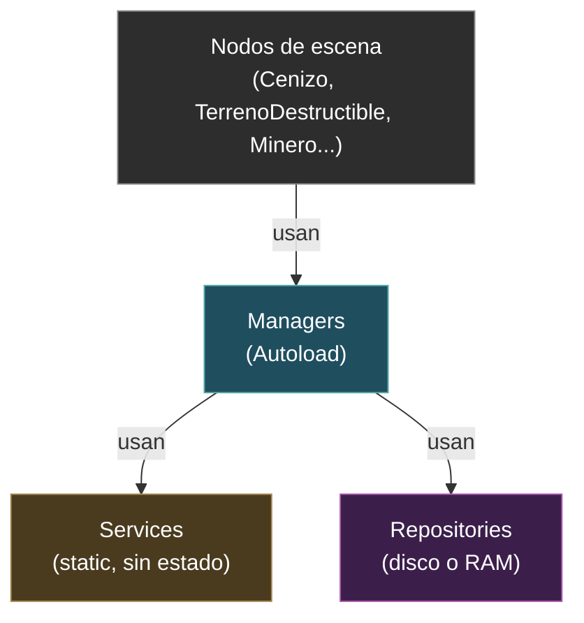
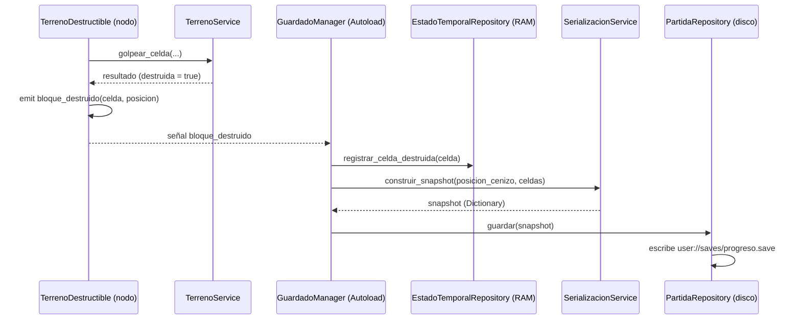
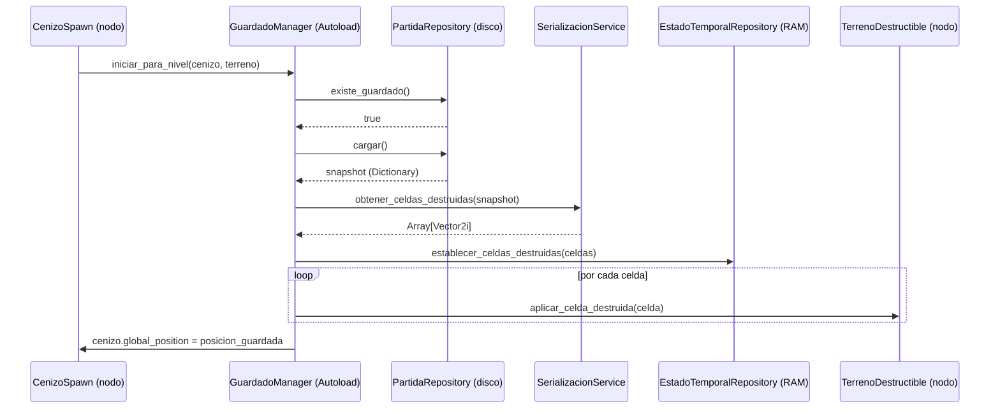

# Arquitectura del proyecto — Cenizos Excavación Maldita

> Este documento está dirigido a cualquier IA o desarrollador que vaya a
> modificar o extender este proyecto Godot 4.7 (GDScript). Su objetivo es
> que puedas decidir **dónde va cada línea de código nueva** sin tener que
> re-descubrir el patrón desde cero.

## 1. Resumen del patrón

El proyecto usa una variante liviana de **Managers / Services / Repositories**,
adaptada a las convenciones nativas de Godot (Autoload, `class_name`, señales).

| Capa | Qué hace | Cómo vive en Godot | Ejemplo |
|---|---|---|---|
| **Manager** | Orquesta el flujo del juego: decide *cuándo* pasa algo, conecta señales, coordina Services y Repositories | `Node`, registrado como **Autoload** en `project.godot` | `GuardadoManager`, `GameManager` |
| **Service** | Lógica pura y reutilizable: *cómo* se calcula algo. Sin estado propio, sin acceso a disco, sin conocer nodos de escena | `RefCounted` con `class_name`, **solo `static func`**, NO es Autoload | `TerrenoService`, `SerializacionService` |
| **Repository** | Única capa que toca persistencia (disco) o estado temporal de sesión (RAM) | Si es guardado real en disco → `RefCounted` con `class_name` y `static func` (ej. `PartidaRepository`). Si es estado compartido en RAM entre managers → Autoload (ej. `EstadoTemporalRepository`) | `PartidaRepository`, `EstadoTemporalRepository` |

Los **nodos de escena** (`Cenizo`, `TerrenoDestructible`, `Minero`, etc.)
siguen siendo controllers normales de Godot: reciben input, manejan
física/animación, y **delegan** cálculos puros a un Service cuando aplica.

## 2. Regla de dependencia (no romper esto)



- Un **Service** NUNCA llama a un Manager, ni a otro Repository, ni conoce
  nodos de escena. Solo recibe datos por parámetro y devuelve resultados.
- Un **Repository** NUNCA contiene reglas de juego. Solo lee/escribe datos
  (archivo o Dictionary en RAM) tal como se lo pasan.
- Un **Manager** puede usar Services y Repositories, y puede conectarse a
  señales de nodos de escena. Es la única capa "inteligente" sobre el flujo.
- Los nodos de escena pueden llamar Managers (vía Autoload, ej. `GameManager.foo()`)
  pero no deberían acceder a Repositories directamente — eso es trabajo del Manager.

## 3. Estructura de carpetas

```
scripts/
  managers/          → Autoloads. Orquestan flujo de juego.
    game_manager.gd
    guardado_manager.gd
  services/          → class_name + static func. Lógica pura.
    terreno_service.gd
    serializacion_service.gd
  repositories/
    temporal/        → Autoload. Estado de sesión en RAM.
      estado_temporal_repository.gd
    partida/         → class_name + static func. I/O real a disco.
      partida_repository.gd
  personajes/        → Nodos/controllers (Cenizo, CenizoSpawn, etc.)
  objetos/           → Nodos/controllers auxiliares (cámara, escaleras, etc.)
  terreno_destructible.gd, minero.gd, puntero_pico.gd  → Nodos raíz sueltos
```

Convención de nombres: **español, snake_case** para archivos y variables,
**PascalCase** para `class_name` y nombres de Autoload — igual que el resto
del código base ya existente.

## 4. Ejemplo real ya implementado (guardado de progreso)

Sirve como plantilla para features nuevas. Flujo de **autosave** al romper un bloque:



Flujo de **carga** al iniciar el nivel:



La lógica pura de "cuántos golpes hacen falta para romper un bloque" vive en
`@/Users/normanth.glaves/Documents/github@worker8/CenizosExcavacionMaldita/cenizos-excavacion-maldita/scripts/services/terreno_service.gd` como funciones `static`, y el nodo
`terreno_destructible.gd` solo la invoca y emite señales.

## 5. Cómo implementar una feature nueva — árbol de decisión

Antes de escribir código, respondé estas preguntas en orden:

1. **¿Es lógica que reacciona a un evento del juego o coordina varios pasos?**
   → Va en un **Manager**. Si no existe uno adecuado, creá
   `scripts/managers/<nombre>_manager.gd` y registralo como Autoload en
   `project.godot` (sección `[autoload]`).

2. **¿Es un cálculo puro (recibe datos, devuelve un resultado, sin tocar
   disco ni nodos)?**
   → Va en un **Service**. Creá `scripts/services/<nombre>_service.gd` con
   `class_name <Nombre>Service`, `extends RefCounted`, y solo `static func`.
   No lo registres como Autoload.

3. **¿Necesita persistir algo en disco (`user://`) o compartir estado entre
   escenas sin guardarlo en disco?**
   → Va en un **Repository**.
   - Si es disco real: `scripts/repositories/<dominio>/<nombre>_repository.gd`,
     `class_name`, `static func`, usa `FileAccess`/`DirAccess`.
   - Si es RAM de sesión: mismo patrón pero como Autoload (`extends Node`,
     variables de instancia, sin `static`).

4. **¿Es comportamiento de un nodo concreto en la escena (input, física,
   animación, colisiones)?**
   → Se queda como **nodo/controller** normal (ej. `cenizo.gd`, `minero.gd`).
   Si ese nodo necesita lógica pura reutilizable, la extrae a un Service en
   vez de tenerla inline (ver ejemplo de `terreno_destructible.gd`).

## 6. Checklist antes de dar por terminada una feature

- [ ] ¿Los Services que agregué son `static` y no dependen de ningún Autoload?
- [ ] ¿El Manager nuevo está registrado en `project.godot` → `[autoload]`?
- [ ] ¿El Repository de disco maneja el caso "archivo no existe" sin crashear?
- [ ] ¿Evité que un Repository contenga reglas de juego (eso es de un Service o Manager)?
- [ ] ¿Los nodos de escena siguen sin acceder directo a un Repository (pasan por un Manager)?
- [ ] ¿Nombres en español/snake_case consistentes con el resto del proyecto?

## 7. Estado actual de la arquitectura (referencia rápida)

**Managers (Autoload):** `GameManager`, `GuardadoManager`
**Repositories RAM (Autoload):** `EstadoTemporalRepository`
**Services (static, sin autoload):** `TerrenoService`, `SerializacionService`
**Repositories disco (static, sin autoload):** `PartidaRepository`

**Alcance actual del guardado:** posición del Cenizo + celdas de terreno
destruidas, con autosave disparado por la señal `bloque_destruido`.
**Fuera de alcance todavía (pendiente si se pide):** persistencia de niebla
de guerra, múltiples slots de partida, UI de guardado/carga manual.
